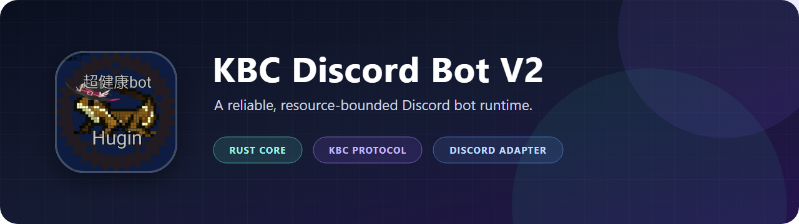
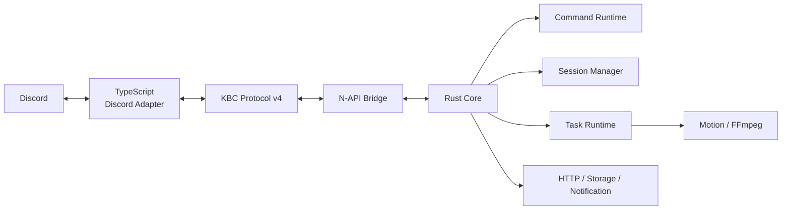

<p align="center">
  
</p>

<p align="center">
  <strong>Rust Core × TypeScript Discord Adapter</strong><br>
  長期運用、省リソース、安全な並行処理を重視したDiscord Bot
</p>

<p align="center">
  <a href="https://github.com/sinsuirakv0/KBC-rakv0-discord-bot-v2/releases/latest"></a>
  <a href="https://github.com/sinsuirakv0/KBC-rakv0-discord-bot-v2/actions/workflows/ci.yml"></a>
  <a href="https://github.com/users/sinsuirakv0/packages?repo_name=KBC-rakv0-discord-bot-v2"></a>
  <a href="docs/architecture/PROTOCOL.md"></a>
</p>

<p align="center">
  <a href="https://github.com/sinsuirakv0/KBC-rakv0-discord-bot-v2/releases/latest">最新Release</a> ・
  <a href="https://github.com/users/sinsuirakv0/packages?repo_name=KBC-rakv0-discord-bot-v2">Packages</a> ・
  <a href="#architecture">Architecture</a> ・
  <a href="#quick-start">Quick Start</a> ・
  <a href="docs/">Documentation</a>
</p>

---

## Overview

KBC Discord Bot V2は、Discord固有の入出力とBot本体を明確に分離したDiscord Botです。TypeScriptは`discord.js`を扱う薄いAdapterに限定し、Command、Session、Task、HTTP、Storage、通知、Motion生成などのBotロジックをRust Coreが所有します。

| 特長 | 内容 |
|---|---|
| 🦀 **Rust Core** | 型安全性、Ownership、RAIIを長期運用の信頼性へ活用 |
| 🔌 **Thin Adapter** | TypeScriptはDiscord EventとKBC Protocolの変換に集中 |
| 🚦 **Bounded Runtime** | Queue、HTTP、Task、Session、Bufferを有限化して過負荷を制御 |
| 🎞️ **Motion Rendering** | Rustで逐次描画し、FFmpegでMP4/GIFを生成 |
| 🔔 **Notification** | GitHub Storageと連携した重複防止・永続Checkpoint付き通知 |
| 📏 **Measured Performance** | 推測ではなく計測結果を基に低CPU環境へ最適化 |

## Architecture



Rustの`kbc-protocol`がProtocol型の正本です。TypeScript型はRust定義から生成し、Rust CoreとDiscord AdapterのProtocol versionが一致しない場合は起動を停止します。Motionのframe dataはN-APIやJSONを通さず、Rust所有の一時FileとしてDiscord Adapterへ渡します。

詳しい責務境界は[設計原則](docs/architecture/PRINCIPLES.md)、[Runtime設計](docs/architecture/RUNTIME.md)、[Discord Adapter設計](docs/architecture/DISCORD_ADAPTER.md)を参照してください。

## Features

- `ut`、`tut`、`item`、`sale`、`gatya`などのData検索Command
- Reactionを使った所有者限定・期限付きSession
- PNG、MP4、GIF対応のMotion生成Task
- 外部更新の検証、通知、再送時の重複防止
- Channel単位の順序を保つ有限並列Discord Action Dispatcher
- Command時間、Event Queue、Motion phaseの軽量な観測情報
- Local、Docker、Northflankを想定した共通Runtime

## Quick Start

### Requirements

- Node.js 24とnpm
- Rust 1.89以上、Cargo、rustfmt、Clippy
- Discord Bot Token
- Discord Developer Portalで必要なGateway Intentを有効化

FFmpegは`ffmpeg-static`を利用します。別の実行Fileを使う場合だけ`FFMPEG_PATH`を指定してください。Windows固有のRust環境は[Workspace実装](docs/implementation/WORKSPACE.md)にまとめています。

### 1. Install

```powershell
npm ci
Copy-Item .env.example .env
```

### 2. Configure

`.env`へ最低限`DISCORD_TOKEN`を設定します。隣接する旧Repositoryの設定を安全に移行する場合は、次のScriptを利用できます。

```powershell
npm run setup:local
```

### 3. Run

```powershell
npm run local
```

Release profileのNative moduleとTypeScriptをbuildし、Local Botを起動します。Localから送信したMessageには`[local] `が付与されます。詳しくは[Local開発起動](docs/implementation/LOCAL_DEVELOPMENT.md)を参照してください。

## Container

Release版のContainer imageはGitHub Container Registryから取得できます。

```text
docker pull ghcr.io/sinsuirakv0/kbc-rakv0-discord-bot-v2:latest
docker run --rm --env-file .env -p 3000:3000 ghcr.io/sinsuirakv0/kbc-rakv0-discord-bot-v2:latest
```

特定Versionを固定する場合は、`latest`の代わりに`0.1.0`のようなtagを指定します。SecretをimageやRepositoryへ含めず、実行環境の環境変数として渡してください。

Localでimageをbuildすることもできます。

```text
docker build -t kbc-discord-bot-v2 .
```

## Build and Validation

```text
npm run build
npm run typecheck
npm run check:rust
cargo fmt --check
cargo clippy --workspace
cargo test --workspace
```

`npm run generate:protocol`はRust定義からTypeScriptのProtocol型を再生成します。CIでは生成後の差分も検査し、commit済みTypeScript型とのずれを検出します。

## Configuration

| 変数 | 必須 | 用途 |
|---|---|---|
| `DISCORD_TOKEN` | はい | Discord Bot Token |
| `FFMPEG_PATH` | いいえ | `ffmpeg-static`以外のFFmpeg実行File |
| `GITHUB_DATA_OWNER` | 条件付き | 通知設定保存先のGitHub owner |
| `GITHUB_DATA_REPO` | 条件付き | 通知設定保存先のprivate Repository |
| `GITHUB_DATA_BRANCH` | いいえ | 保存先branch。既定は`main` |
| `GITHUB_DATA_TOKEN` | 条件付き | 保存先RepositoryのContents read/write Token |
| `EVENT_UPDATE_SECRET` | いいえ | 外部更新受信を有効化する共有Secret |
| `EVENT_UPDATE_PORT` | いいえ | HTTP受信Port。既定は`PORT`または`3000` |
| `EVENT_UPDATE_HOST` | いいえ | HTTP listen host。既定は`0.0.0.0` |
| `PORT` | いいえ | `EVENT_UPDATE_PORT`未指定時に使うPlatform指定Port |
| `NODE_ENV` | いいえ | `production`ではLocal表示Prefixを無効化 |

GitHub Data関連のowner、Repository、Tokenは3項目を同時に設定します。`EVENT_UPDATE_SECRET`を使う場合はGitHub Data設定も必要です。

## Repository Structure

```text
apps/discord/        TypeScript Discord Adapter
crates/kbc-protocol/ Protocol型とTypeScript型生成
crates/kbc-core/     Discord非依存のBot Core
crates/kbc-node/     薄いN-API Bridge
content/             起動時に読む返信・Help Content
docs/                Architecture、Decision、実装資料
scripts/             Build・Local開発補助Script
```

## Documentation

| 分類 | Document |
|---|---|
| Architecture | [設計原則](docs/architecture/PRINCIPLES.md) ・ [Runtime](docs/architecture/RUNTIME.md) ・ [Protocol](docs/architecture/PROTOCOL.md) ・ [Discord Adapter](docs/architecture/DISCORD_ADAPTER.md) |
| Development | [Local開発](docs/implementation/LOCAL_DEVELOPMENT.md) ・ [Command Runtime](docs/implementation/COMMAND_RUNTIME.md) ・ [ReleaseとPackages](docs/implementation/RELEASES.md) |
| Engineering | [Command追加](docs/engineering/COMMANDS.md) ・ [性能設計](docs/engineering/PERFORMANCE.md) ・ [テスト方針](docs/engineering/TESTING.md) |
| Decisions | [Task Runtime](docs/decisions/TASK_RUNTIME_V1.md) ・ [Motion Rendering](docs/decisions/MOTION_RENDERING_V2.md) ・ [HTTPと複数Action](docs/decisions/HTTP_AND_MULTI_ACTION_V1.md) |

## Releases

安定した区切りを`v0.1.0`形式のGit tagと[GitHub Releases](https://github.com/sinsuirakv0/KBC-rakv0-discord-bot-v2/releases)で公開します。Release公開時には同じVersionのContainer imageをGHCRへ生成します。

## Contributors

開発履歴と貢献者は[Contributors Graph](https://github.com/sinsuirakv0/KBC-rakv0-discord-bot-v2/graphs/contributors)で確認できます。

<p align="center">
  <a href="https://github.com/sinsuirakv0/KBC-rakv0-discord-bot-v2/graphs/contributors"></a>
</p>

---

<p align="center">
  Built with Rust, TypeScript, discord.js and FFmpeg.
</p>
